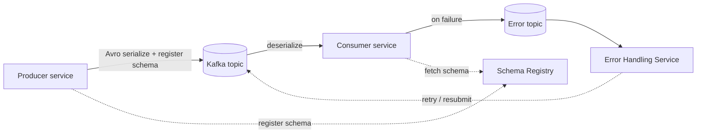

# Architecture

jEAP Messaging organises messaging code into three layers, so that business logic stays free of Kafka
boilerplate and message-type definitions can be shared across services.

## Three layers

- **jEAP layer** — the `jeap-messaging` library itself. It provides the base message types and the
  pre-configured publishers and consumers. Shared across all systems.
- **System layer** — the message-type definitions shared across the microservices of a system,
  typically in a common messages library. A message is defined as an [Avro schema](defining-messages.md),
  usually with a generated builder and listener interface. Kafka configuration (topics, acknowledgment
  strategy) can also be defined here.
- **Service layer** — the individual microservice. It implements message processors (consumers) and
  message generators (producers) as plain business logic, injecting a publisher or implementing a
  `@KafkaListener` and depending on the generated message types.

## Message flow

A producer serializes an Avro message and registers its schema in the [schema registry](message-type-registry.md)
if necessary. A consumer deserializes it. If processing fails, the [error handler](error-handling.md)
writes a `MessageProcessingFailedEvent` to the error topic instead of losing the message, and a
separate Error Handling Service can resubmit it.

## Module map

The consumer-facing artifact is `jeap-messaging-infrastructure-kafka`, which builds on:

- `jeap-messaging-model` — infrastructure-independent event/command interfaces
- `jeap-messaging-avro` — Avro implementation (`AvroMessage`, builders, `AvroSerializationHelper`)
- `jeap-messaging-api` — `MessageListener` / `MessagePublisher` interfaces
- `jeap-messaging-infrastructure` — serialization, signing, crypto, tracing, metrics, health, error handling

Optional concerns plug in by configuration or extra dependencies: the
[Confluent](schema-registry-confluent.md) or [AWS Glue](schema-registry-aws-glue.md) schema registry,
[AWS MSK IAM auth](aws-msk-iam-authentication.md), [idempotence](idempotent-message-handler.md),
[signing](signing-messages.md) and [encryption](encrypting-messages.md). See the full module table in
[jeap-messaging](../README.md) and [Choosing dependencies](dependencies.md).

## Two registries

Two different registries are involved, and they serve different phases:

- The **[Message Type Registry](message-type-registry.md)** is the design-time home of schemas and
  descriptors. It is a Git repository that validates compatibility and publishes generated Java bindings.
- The **Kafka Schema Registry** ([Confluent](schema-registry-confluent.md) or AWS Glue) is the runtime
  home of schemas. jEAP Messaging registers schemas there automatically when sending; this is largely
  transparent to developers.

## Related

- [Getting started](getting-started.md)
- [Message types](message-types.md)
- [Message Type Registry](message-type-registry.md)
- [Error handling](error-handling.md)
