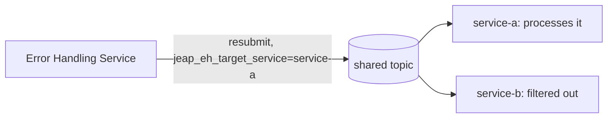

# Message filtering

Since 11.14.0 (jeap-spring-boot-parent 30.14.0), jEAP Messaging automatically discards messages that
the [Error Handling Service](error-handling.md) (EHS) resubmits to a topic when they are not meant for
the consuming service. This is enabled by default — there is nothing to configure.

## Why it exists

Several services can consume the same topic. When processing fails in one of them, the message is sent
to the EHS, which later resubmits it to the **original topic** so it can be retried. Without filtering,
*every* consumer of that topic would receive the resubmitted message again — including services that
already processed it successfully. The filter makes sure only the service the retry was meant for picks
it up.



## How it works

On a resubmit the EHS adds the header `jeap_eh_target_service` carrying the name of the service the
retry is intended for. jEAP Messaging installs a Spring Kafka `RecordFilterStrategy`
(`ErrorHandlingTargetFilter`) on every listener container that decides, per record:

- no `jeap_eh_target_service` header → **keep** (normal first delivery, never filtered);
- header value equals this service's name → **keep**;
- header value is a different service → **discard** (the listener is never invoked).

The consuming service's name is `jeap.messaging.kafka.serviceName`, which defaults to
`${spring.application.name}` (see [Configuration reference](configuration.md)). A discarded record is
logged at `INFO`, naming the resubmitting EHS taken from the `jeap_eh_error_handling_service` header:

```
Filtering out message because 'jeap_eh_target_service=other-service'. Message has been resent by 'my-error-handling-service'
```

## Headers

| Header                           | Set by          | Meaning                                                    |
|----------------------------------|-----------------|------------------------------------------------------------|
| `jeap_eh_target_service`         | EHS on resubmit | Name of the service the retry is intended for              |
| `jeap_eh_error_handling_service` | EHS on resubmit | Name of the EHS that resubmitted the message (for logging) |

Because the filter runs before the listener, a filtered-out message is neither processed nor passed to
the [error handler](error-handling.md), and it is acknowledged like any skipped record — so it does
not block the partition.

## Related

- [jeap-messaging](../README.md)
- [Error handling](error-handling.md)
- [Consuming messages](consuming-messages.md)
- [Configuration reference](configuration.md)
