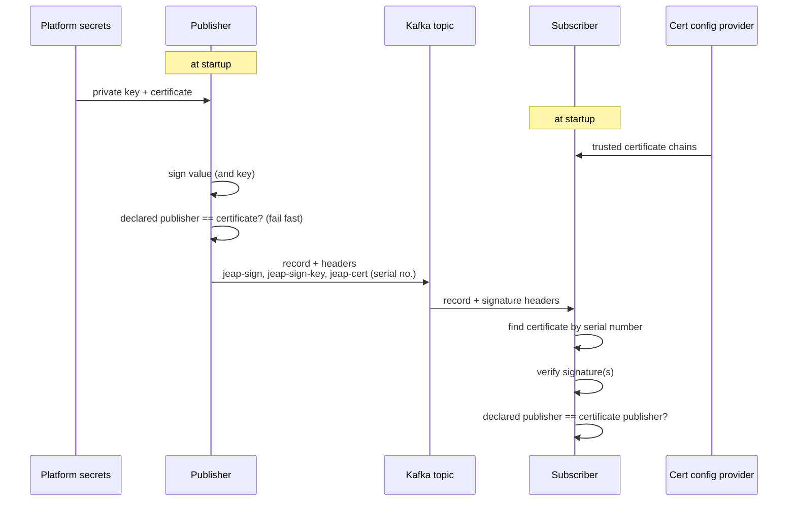

# Signing messages

Since 8.21.0 jEAP Messaging can sign messages on send and verify signatures on receive, so that
consumers can establish which service actually published a message.

## Flow

At startup the library loads the private key and certificate from the platform's secrets management.

On send it signs the value (and the key, if present) and ensures the publisher declared in the
message exactly matches the publisher in the certificate (fail fast). The signature(s) and a
reference to the certificate (its serial number) travel as Kafka record headers: `jeap-sign`,
`jeap-sign-key` and `jeap-cert`.

On receive the library loads the required certificates from the platform config provider, verifies
the signature, determines the effective publisher from the certificate, and verifies that the
declared publisher matches the certificate.

## Publisher configuration

Properties under `jeap.messaging.authentication.publisher.`:

| Name                    | Mandatory                                  | Default | Description                                             |
|-------------------------|--------------------------------------------|---------|---------------------------------------------------------|
| `signature-key`         | Required if `signature-certificate` is set | —       | The private key PEM                                     |
| `signature-certificate` | Required if `signature-key` is set         | —       | The service certificate PEM; contains the serial number |

## Subscriber configuration

Properties under `jeap.messaging.authentication.subscriber.`:

| Name                                    | Mandatory | Default | Description                                                                                                                                                                     |
|-----------------------------------------|-----------|---------|---------------------------------------------------------------------------------------------------------------------------------------------------------------------------------|
| `require-signature`                     | No        | `false` | Strict mode: every message except whitelisted ones must be signed. When `false`, signatures are only checked if the `jeap-sign`/`jeap-sign-key`/`jeap-cert` headers are present |
| `accept-unsigned-messagetype-whitelist` | No        | —       | List of message types allowed without a signature                                                                                                                               |
| `allowed-publishers`                    | No        | —       | Map of message type to list of services allowed to publish it                                                                                                                   |
| `certificate-chains`                    | No        | —       | Map of service to certificate chain (`[leaf, optional intermediates, root]`) used to verify signatures                                                                          |
| `privileged-producer-common-names`      | No        | —       | List of producer-certificate CNs whose signature is verified but NOT matched against the message's declared publisher (for mirroring migrations, e.g. OnPrem to AWS MSK)        |
| `allow-non-jeap-messages`               | No        | `false` | If `true`, non-jEAP messages are allowed and bypass signature checking                                                                                                          |

## Metrics

| Metric                                                | Type    | Description                                             |
|-------------------------------------------------------|---------|---------------------------------------------------------|
| `jeap_messaging_signature_certificate_days_remaining` | Gauge   | Days the publisher certificate is still valid           |
| `jeap_messaging_signature_required_state`             | Gauge   | `1` if the subscriber set `require-signature`, else `0` |
| `jeap_messaging_signature_validation_outcome`         | Counter | Status `OK`/`NOK`, per app and message type             |

In addition, `jeap_messaging_total` gained a `signed` (`0`/`1`) dimension.

## Failure cases

| Case                                               | Consequence                                                          |
|----------------------------------------------------|----------------------------------------------------------------------|
| Publisher private key and certificate do not match | Service cannot start                                                 |
| Strict mode, unsigned, not whitelisted             | Message not consumed, sent to the Error Handling Service (permanent) |
| Signed but matching certificate not configured     | Sent to EHS (temporary, fixable via config)                          |
| Signed but certificate expired                     | Sent to EHS (permanent)                                              |
| Signed but certificate chain invalid               | Sent to EHS (temporary)                                              |
| Certificate CN does not match the sender service   | Sent to EHS (permanent)                                              |
| Signature invalid                                  | Sent to EHS (permanent)                                              |

## Related

- [jeap-messaging](../README.md)
- [Error handling](error-handling.md)
- [Configuration reference](configuration.md)
- [Consuming messages](consuming-messages.md)
